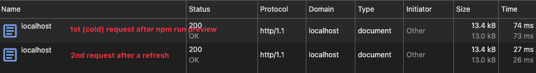
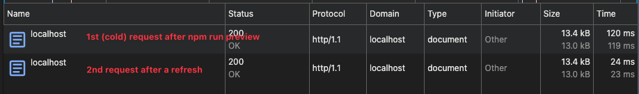

# OpenNext/Cloudflare Performance Tests and comparison between v0.5 and v1

## OpenNext v0.5.12 performance
74ms on a cold request after `npm run preview`

27ms on refresh

## OpenNext v1.2.1 performance
120ms on a cold request after `npm run preview`

24ms on refresh

# Conclusion

> [!CAUTION]
> v1.2.1 has around 40% worse performance on a cold start compared to v0.5.12.
>
> Currently we are testing it with one page and just the default scaffold/template provided by Next.js but, that gap seems to widen the bigger the app is. On bigger OpenNext/Cloudflare projects such as https://agenticdev.agency/ we are seing multiple seconds of latency on cold requests which makes our app unusable.
